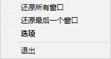
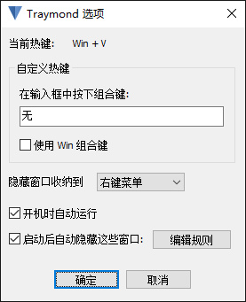
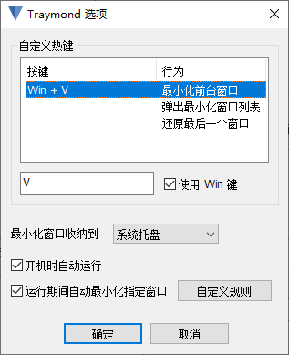
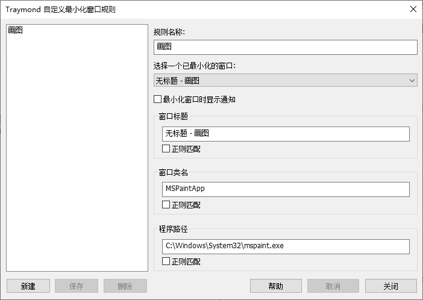

 Traymond（增强版)
=======

Traymond（增强版）是一款能将任意窗口最小化到系统托盘的 Windows 桌面工具。此项目受 [Traymond](https://github.com/fcFn/traymond) 启发，实现以下功能：

- 中文界面
- 开机自动运行
- 可自定义热键
  - 最小化窗口到系统托盘图标或右键菜单
  - 还原最后一个最小化窗口
  - 唤出最小化窗口列表
- 通过自定义规则自动最小化窗口

## 安装

1. 从 https://github.com/tabris17/traymond/releases/latest 下载可执行文件直接运行；

2. 使用 Scoop

   ```cmd
   scoop install https://github.com/tabris17/traymond/releases/latest/download/traymond.json
   ```

## 用法

程序运行后会常驻系统托盘。按下默认热键 <kbd>Win</kbd> + <kbd>Shift</kbd> + <kbd>Z</kbd> 最小化当前窗口到系统托盘。可以在“选项”中设置最小化窗口收纳至托盘图标或者右键菜单。



鼠标双击托盘图标  或者在右键菜单中选择“选项”，打开“Traymond 选项” 对话框。



### 自定义热键

在“自定义热键”列表内选中需要设置热键的行为，在下方的热键控件中按下自定义热键组合。由于热键控件无法响应按下 <kbd>Win</kbd> 键，如果要使用 <kbd>Win</kbd> 作为修饰键，请勾选“使用 Win 键” 选择框。



### 自动最小化窗口

在“Traymond 选项”对话框中勾选“运行期间自动最小化指定窗口”选择框，以启用自动最小化窗口功能。点击“自定义规则”按钮设置规则。



具体设置方法请参考项目[维基](/tabris17/traymond/wiki)。