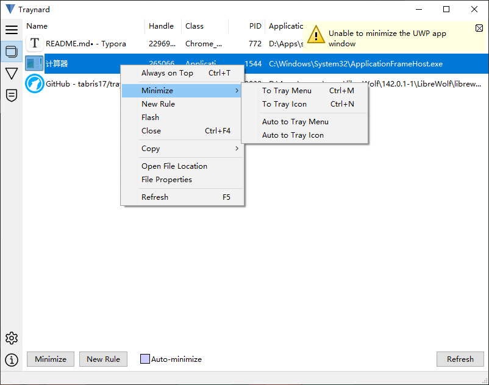
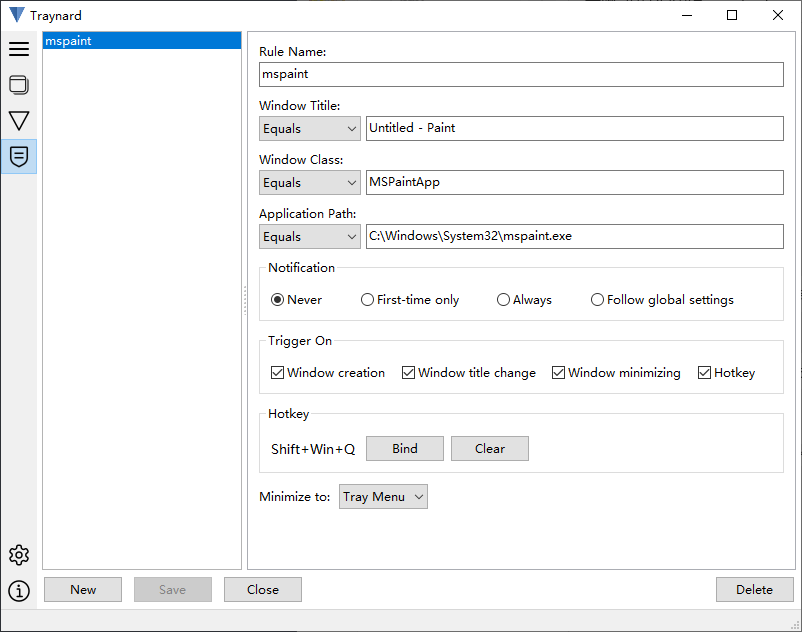
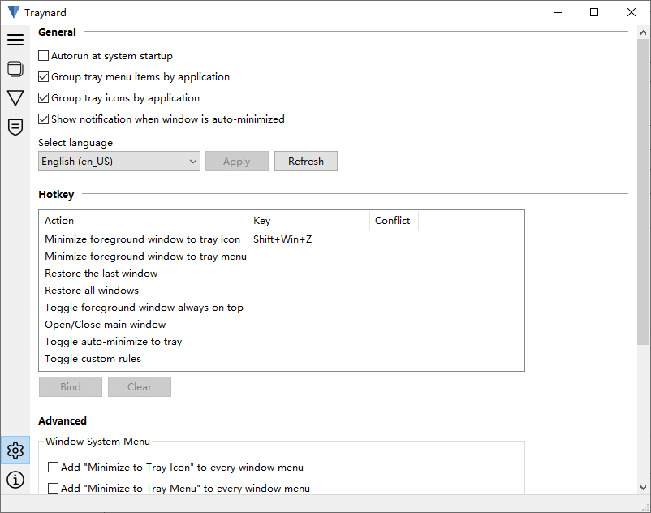

#  Traynard

[[简体中文](docs/README.zh_CN.md)]

Traynard is a Windows desktop utility for minimizing any application window to the system tray, A.K.A. "notification area". The project is inspired by [Traymond](https://github.com/fcFn/traymond) and completely rewritten in Lazarus (free pascal). The original project (Traymond 增强版) code can be accessed from the [traymond](https://github.com/tabris17/traynard/tree/traymond) branch.

## Features

1. Quick actions via global hotkeys

2. Extended system menu for any window

3. Auto-minimize windows by user rules

4. Multi-language support

## Installation

Download the archive from the [Releases](https://github.com/tabris17/traynard/releases/latest) page, extract it locally, and then run **traynard.exe** directly.

There are two release versions:

1. **Standalone**: Only one executable file, with configuration data written to the user’s **AppData**.
2. **Portable**: Configuration data is stored in the **data** folder within the program directory.

It can also be installed via **[scoop](https://scoop.sh/)** command:

```cmd
scoop install https://github.com/tabris17/traynard/releases/latest/download/traynard.json
```

## Usage

You can still use the default hotkey **"Shift + Win + Z"** to minimize the current window to the system tray, just like the original Traymond, and it can also be customized in the settings.

You can choose whether to minimize the window to a new tray icon or to a **Traynard** main icon popup menu item.

Traynard provides the following methods for minimizing windows:

1. Global hotkeys
2. Main dashboard for window management
3. Extended system menu of the target window
4. Mark the window as "**Auto-minimize**"
5. Custom rules

## Screenshot







## Known Issues

1. Unable to operate the windows of **UWP** applications.
2. Unable to operate the windows of applications running as administrator, unless traynard is also run as administrator.
3. When "**Extended system menu**" is enabled, the following applications have compatibility issues:
   - Microsoft Edge

