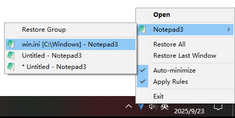
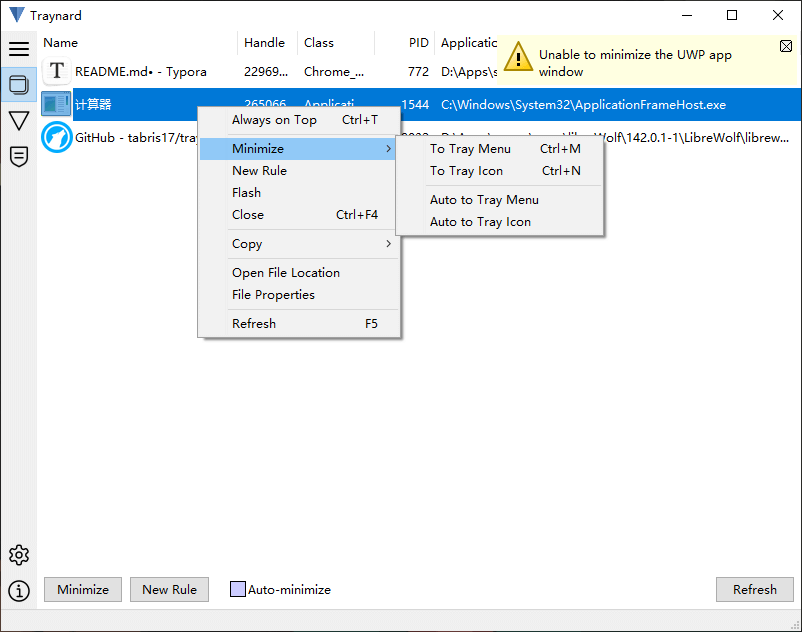
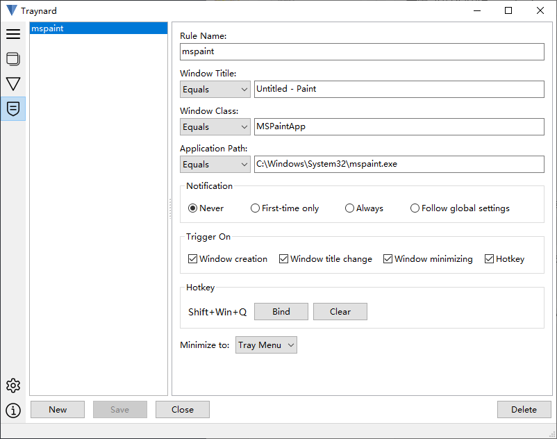
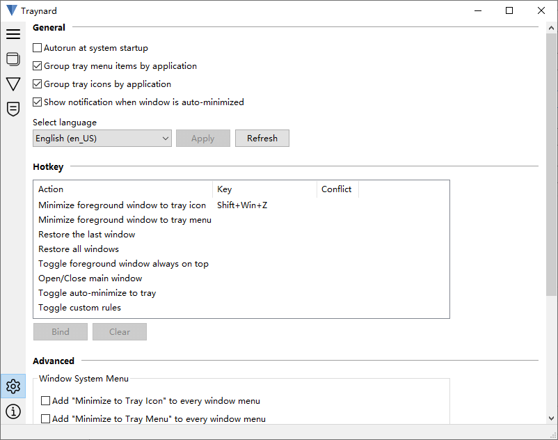

#  Traynard

Traynard 是一款 Windows 桌面工具，可将任意应用窗口最小化到系统托盘（又称“通知区域”）。该项目受到 [Traymond](https://github.com/fcFn/traymond) 启发，并使用 Lazarus（Free Pascal）完全重写。原项目（Traymond 增强版）的代码可从 [traymond](https://github.com/tabris17/traynard/tree/traymond) 分支访问。



## 功能

1. 通过全局热键快速操作

2. 扩展任意窗口的系统菜单

3. 根据用户规则自动最小化窗口

4. 多语言支持


## 安装

从 [Releases](https://github.com/tabris17/traynard/releases/latest) 页面下载压缩包，在本地解压后直接运行 **traynard.exe** 可执行文件。

存在两种发行版本：

1. **单文件版**：仅一个可执行文件，配置数据将保存在当前用户的 **AppData** 下。
2. **便携版**：配置数据将保存在程序目录的 **data** 文件夹下。

可以通过 [**scoop**](https://scoop.sh/) 命令进行安装：

```cmd
scoop install https://github.com/tabris17/traynard/releases/latest/download/traynard.json
```

## 用法

你仍然可以使用默认热键 **"Shift + Win + Z"** 将当前窗口最小化到系统托盘，就像原版 Traymond 一样，同时该热键也可以在设置中自定义。

你可以选择将窗口最小化为独立的托盘图标，或最小化到 **Traynard** 主图标的弹出菜单项。

Traynard 提供以下几种最小化窗口的方法：

1. 全局热键
2. 程序窗口管理主面板
3. 目标窗口的扩展系统菜单
4. 将窗口标记为“**自动最小化**”
5. 自定义规则

## 软件截图







## 已知问题

1. 无法操作 **UWP** 应用的窗口。
2. 无法操作以管理员权限运行的应用窗口，除非 **Traynard** 也以管理员权限运行。
3. 启用“**扩展系统菜单**”时，以下应用存在兼容性问题：
   - Microsoft Edge

